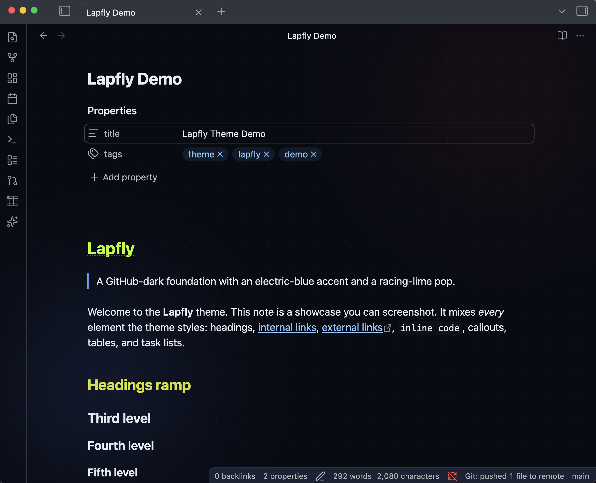

# Lapfly

An [Obsidian](https://obsidian.md) theme based on the [lapfly.com](https://lapfly.com) colour scheme: a GitHub-dark foundation with a signature electric-blue accent and a racing-lime pop. Ships **dark** and **light** modes.

## Palette

| Role            | Dark        | Light       |
| --------------- | ----------- | ----------- |
| Canvas          | `#080c14`   | `#ffffff`   |
| Editor bg       | `#0d1117`   | `#f6f8fa`   |
| Surface         | `#161b22`   | `#eaeef2`   |
| Borders         | `#30363d`   | `#afb8c1`   |
| Normal text     | `#e6edf3`   | `#1f2328`   |
| Muted text      | `#8b949e`   | `#57606a`   |
| Primary accent  | `#58a6ff`   | `#0969da`   |
| Racing lime     | `#b8ff00`   | `#b8ff00`   |

The lime appears as small "speed line" touches: the active-tab indicator, checked task boxes, blockquote rules, and link-hover underlines.

## Install

### Manual

1. Create a folder `Lapfly` in your vault's `.obsidian/themes/` directory.
2. Copy `manifest.json` and `theme.css` into it.
3. In Obsidian: **Settings → Appearance → Themes → Manage** and select **Lapfly**.

## Develop

`theme.css` overrides Obsidian's base colour scale (`--color-base-00` … `--color-base-100`), the brand colour hues (`--color-red`, `--color-blue`, …), and the HSL accent (`--accent-h/s/l`) per `.theme-dark` / `.theme-light`, then adds a handful of component refinements at the bottom.

## License

MIT — see [LICENSE](LICENSE).
